# Active Directory Domain Service (AD DS) installation

### Goal: 
   - Install ***Active Directory Domain Services (AD DS)*** and promote ***DC01*** to a ***Domain Controller***.

---

### ==Step 1==: Install Active Directory Domain Services (AD DS):

   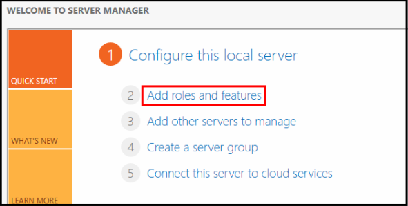
   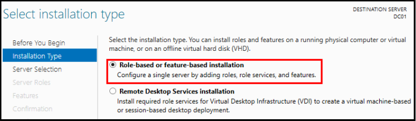
   **Select *"Active Directory Domain Services"* from the *Server Roles* list:**
   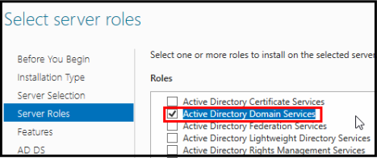
   
   **Install selected Tools and Services:** 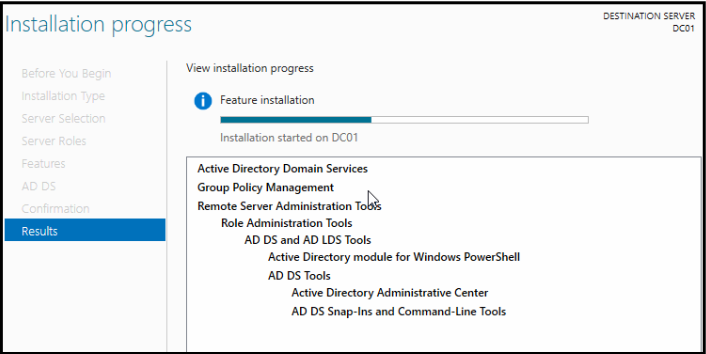

### ==Step 2==: Promote the server to a Domain Controller:

   **After the installation process is complete, we are able to promote the server to a *Domain Controller*:**
   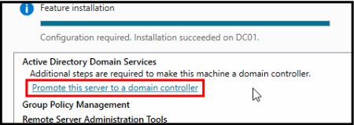

   **A new forest was created because this was the first *Domain Controller* within a new *Active Directory* environment:**
   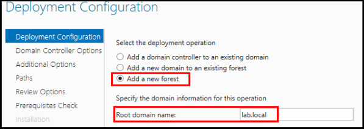

   **Select the functional level and capabilities of the *Domain Controller*:**
   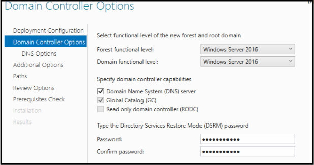
	   - ***Functional level*** refers to the available features throughout the Active Directory environment. Since the environment uses ***Windows Server 2022***, I selected the highest available level at the time (***Windows Server 2016***).
   
   **Since a new forest was created within an isolated homelab environment rather than an existing DNS infrastructure, Microsoft wasn't able to create a *DNS delegation*, as there was no DNS zone above it:** 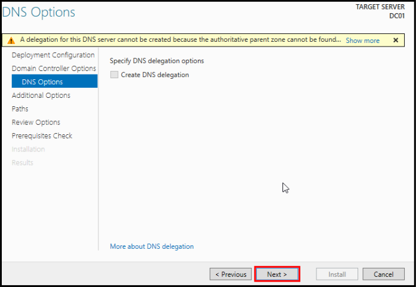
	   - ***DNS delegation*** was skipped by leaving it unchecked.

   **Automatically assigned *NetBIOS* name:**
   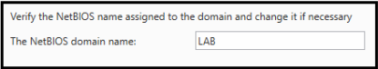
	   - The name ***"LAB"*** was automatically generated from the domain name (***lab.local***) and was left unchanged.
   
   **After successfully promoting to a *Domain Controller*, the server initiated an automatic restart:**  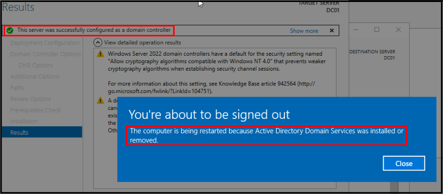

   **Post-reboot verification of *AD DS + DNS* install and *Domain Controller* promotion:**
   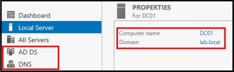
   
