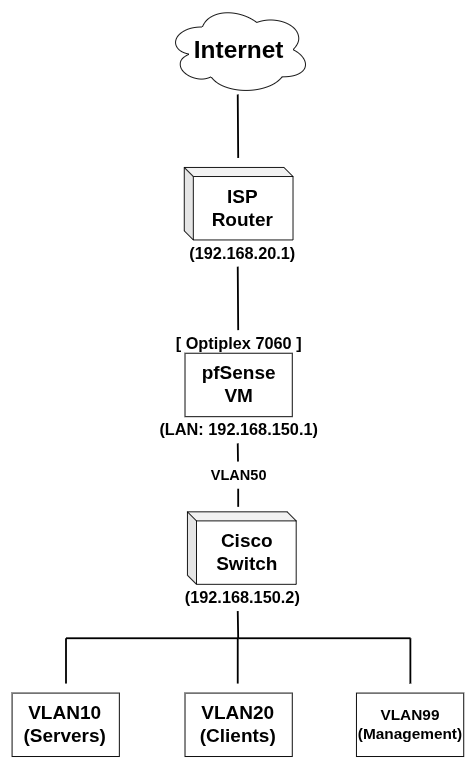

# Enterprise Networking & Active Directory Homelab
---
#### Project status:

	🟢 Active Development

### PROJECT OVERVIEW

This project is designed to simulate a real enterprise network environment with a goal of teaching core networking, system administration and troubleshooting skills. Rather than focus on individual technologies in isolation, I wanted to build an environment where multiple systems depended on one another, creating opportunities to troubleshoot real-world issues.

### Key Objectives

- Set up and configure server virtualization
- Build an Active Directory environment
- Separate users into different groups/departments
- Add VLAN segmentation for servers and client machines
- Implement and manage firewall rules
- Add a managed a layer 3 switch to handle inter-VLAN routing

### Technologies Used

- Optiplex 7060
- Proxmox
- Windows Server / Active Directory
- pfSense
- Cisco Catalyst 3560-X
- VLANs / Inter-VLAN Routing
- DNS / DHCP / NTP

## CURRENT LAB DIAGRAM

#### Note:
	This diagram will be updated as the project evolves.
