 # VLAN Migration

### Goal:
   - Successfully move the Domain Controller over to VLAN10 (192.168.110.0/24)

---

 

### <mark>Step 1</mark>: Prepare Proxmox and pfSense for VLAN migration:

 

**Made the Proxmox bridge VLAN-aware:**
>
>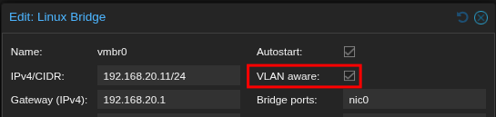

**Set the VLAN tag directly to the VM instead of the VirtIO adapter inside Windows:**
>
>
>	
>**Why?:**
> - This provides centralized management making it easier to troubleshoot potential issues in the future.
>
> - Users inside the VM cannot accidentally break VLAN configuration.
---
 

### <mark>Step 2</mark>: Start the migration process:

 

**Manually assigned the Domain Controller an address of 192.168.110.10:**

>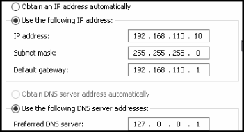

#### 🟥 Problem #1:
Upon moving **the Domain Controller** to **VLAN10**, all reachibility to addresses outside of VLAN10 was lost.

**Ping test from Domain Controller:**
>  
>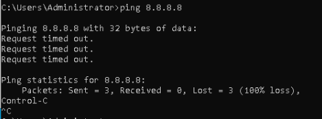

#### 🟨 Theory:
Incoming traffic back to **VLAN10** was getting dropped by the **ISP router** because it didn't know where **192.168.110.10 (Domain Controller's address)** was.

#### 🟩 Solution:
**Added static routes to the ISP router config:** 
>
>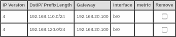
> - 192.168.20.100 = VLAN99 SVI

 

#### 🟥 Problem #2:
**Using tracert, we see that traffic has no trouble reaching the ISP router, however after that, the traffic is dropped:**
>
>

#### 🟨 Updated theory:
Since setting static routes for **VLAN10 and VLAN20** did NOT resolve the problem, the issue is likely occurring **beyond the router**. This may suggest that the **ISP router is unable or unwilling to NAT traffic** from VLAN10, preventing traffic from finding its way back to **the Domain Controller**.

### 🟩 Solution/Change of plan:
Unfortunately, this **ISP router does NOT provide NAT setting** that can be changed in order to resolve this issue. Because of this, **pfSense will be reintroduced as an edge router** while still having the switch handle all inter-VLAN routing.

---
 

### <mark>Step 3</mark>: Create and configure a transit VLAN:

 

#### Why a transit VLAN?:
> The **switch and pfSense will now both be routing to eachother**, but both live in different subnets. **VLAN50 (Transit VLAN)** was created as a direct link for both routing devices to communicate.

 

### VLAN50 = 192.168.150.0/30
**Why /30?:**
> Only the **pfSense gateway (192.168.150.1)** and the **switch's VLAN50 SVI (192.168.150.2)** will be on this VLAN, meaning **only 2 host addresses are needed**.

 

**VLAN50 created:**

> 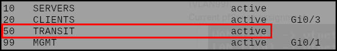

**Switch's VLAN50 SVI:**

> 
	
**Switch's new default gateway (pfSense):**

> 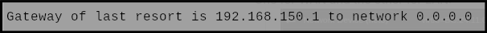

**Two NICs were added to the pfSense VM:**

> 
> 
> - **net0** = WAN
> - **net1** = LAN (VLAN traffic)
> 
> **net0 was left without a VLAN tag** since all **untagged WAN traffic** will be going through the **native VLAN (VLAN99)**.
> 
**pfSense WAN and LAN assignment:**

> 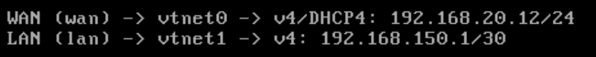

---
 

### <mark>Step 4</mark>: Set up pfSense static routes and NAT rules:

 

**Temporary "Allow Any" rule added to the LAN firewall in pfSense:**

> 
> - This would ensure all traffic could cross over the **transit VLAN (VLAN50)**.

**Successful ping test from the switch to pfSense:**

> 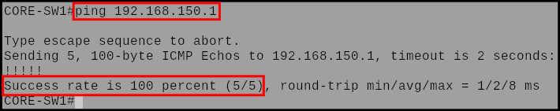

**Static routes added for VLAN10 and VLAN20:**

> 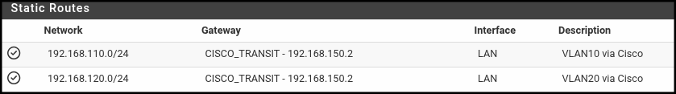
> - Without these, **pfSense** wouldn't know where to send traffic to for either subnet.
	
**Outbound NAT rules created for both VLANs:**

> 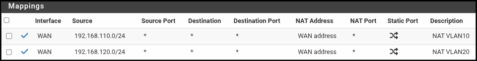
> - This resolves the original issue by allowing **pfSense to perform outbound NAT** for the **VLAN networks** before forwarding traffic to the **ISP router**.

 

### 🟩 Result:

The **Domain Controller had been successfully migrated to VLAN10**, and traffic was now able to reach beyond the ISP router without being dropped.

**Successful DC ping test:**

> 

**Successful DC DNS test:**

> 

--- 
 

### <mark>Updated traffic flow</mark>:

> 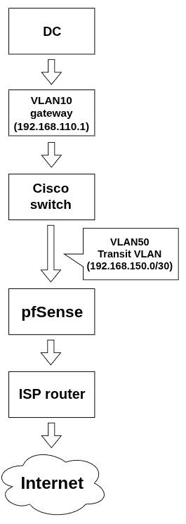
