# Windows Server Install + Set Up

### Goal:
   - Create and configure a ***Windows Server*** virtual machine that will take the role of the ***Domain Controller*** in the ***Active Directory*** environment.

---

 

### <mark>Step 1</mark>: Create virtual machine and attach Windows Server ISO:

 

**VM Name:** DC01
> 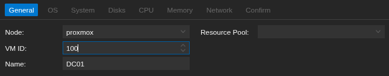
>
> - **DC01 was chosen because this machine would become the *Domain Controller* for the *Active Directory* environment.**

**OS:**
> 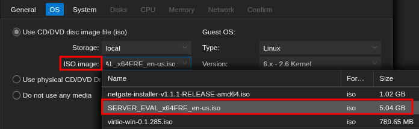
>
> - **ISO image:** Windows Server 2022

**Disk:** 
> 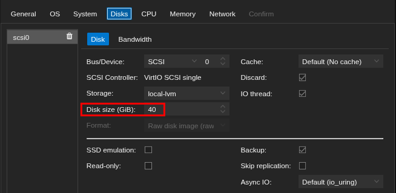
> 
> - **Disk size:** 40GB

 **CPU:** 
> 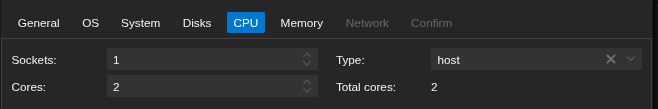
> 
> - **Cores:** 2
> - **Type:** host

**Memory:**
> 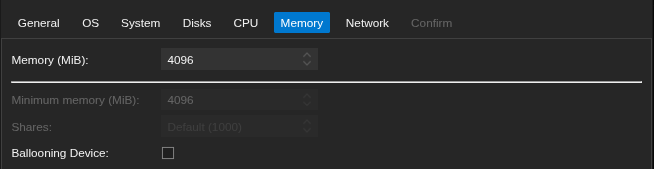
> 
> - **MiB:** 4GB

**Network:**
> 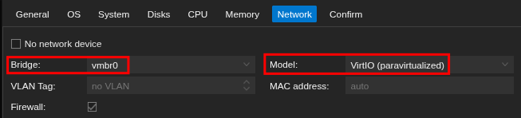
> 
> - **Bridge:** vmbr0
> - **Virtual network card:** VirtIO

 

### <mark>Step 2</mark>: Attach VirtIO ISO and load storage driver:

 

#### VirtIO:
   - **VirtIO** is a set of drivers designed for virtual machines. It allows the VM to communicate more efficiently with Proxmox than traditional emulated hardware, resulting in better performance. The downside is that **Windows Server does not recognize it out of the box**, so the **VirtIO driver ISO** will have to be attached during installation.

 

**Attach VirtIO ISO:**
> 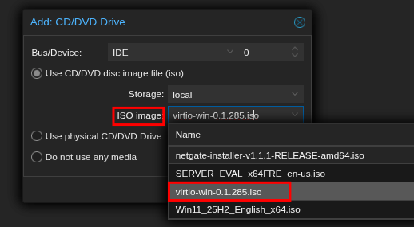
	   
**Load VirtIO storage driver:**
> 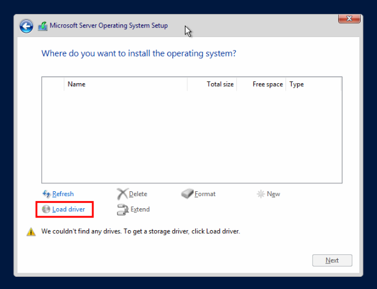
> 
**Windows Server could not detect a virtual disk because the VirtIO storage drivers are not included by default.**

> 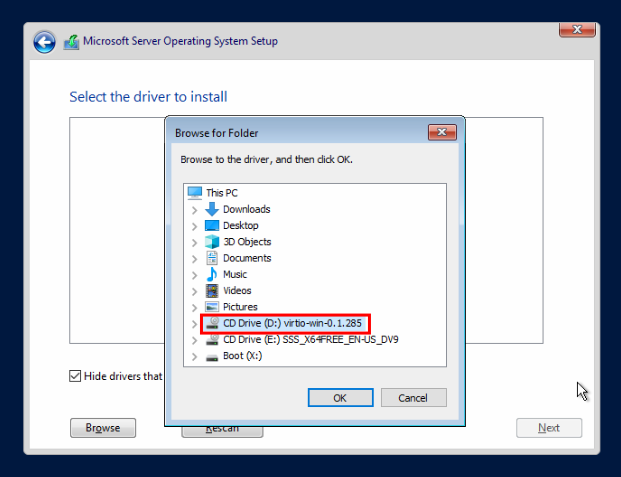
>
> 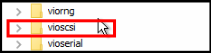
> 
> 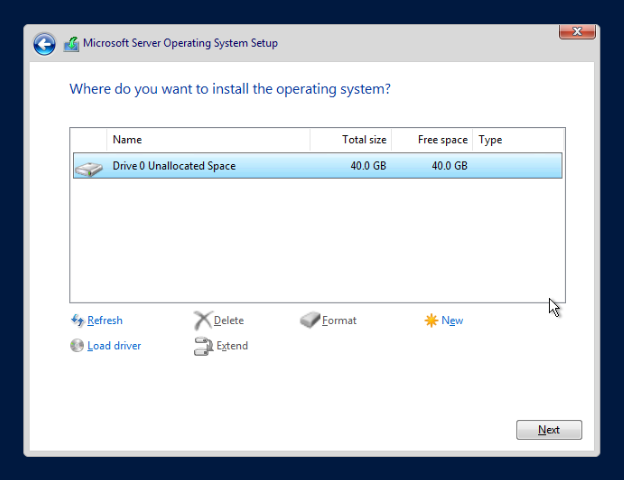
> 
> - **After loading the VirtIO storage driver from the attached VirtIO ISO, Windows Server was able to detect the virtual disk and installation could proceed as normal.**

 

### <mark>Step 3</mark>: Initial Windows Server configuration:

 

**The Server was renamed to DC01 to identify it as the first Domain Controller in the environment:**
> 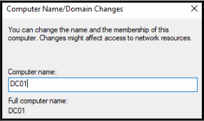

**Install VirtIO network driver:**
> 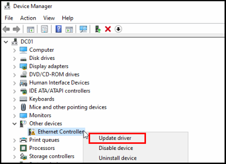
> 
> 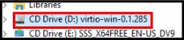
> 
> 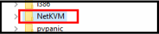
> 
> 
	   
**VirtIO network driver successfully installed:**
> 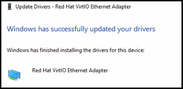

 

### <mark>Step 4</mark>: Configure Static IP:

 

**Domain Controller static IP: *192.168.50.10***

**Subnet: *192.168.50.0/24***
> 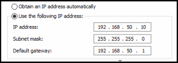

**DNS server: *192.168.50.10 (Domain Controller itself)***
> 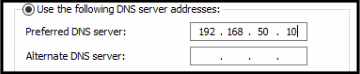
> 
> - **The Domain Controller was configured to use itself as its DNS server, as Active Directory relies on DNS for service discovery and authentication. External DNS requests would later be forwarded upstream as required.**

**Verification:**
> 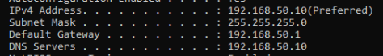
> 
> - **The network configuration was verified using *ipconfig /all.***
	   
