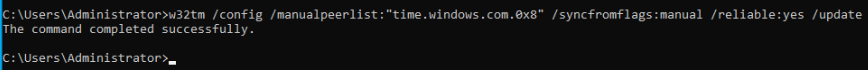
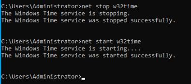
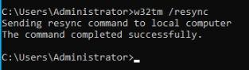
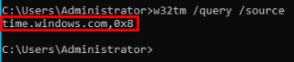
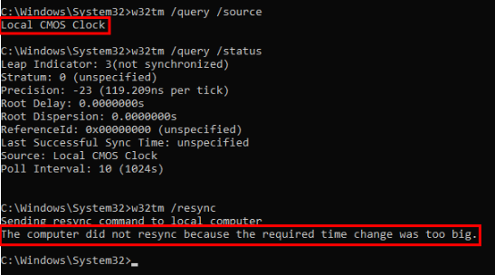
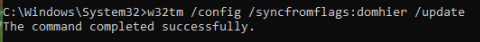
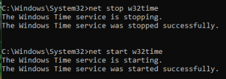
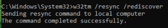
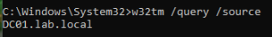

# Domain Controller + Windows Client time sync 

### Goal:
   - Establish synchronization of time between the Domain Controller and client machine.

---

**Purpose of time synchronization in a *Active Directory* environment:**

> Excessive time drift between a Domain Controller and client machine can cause:
>> - Kerberos failures
>> - External service failures
>> - Log timestamp inaccuracy
>
> The implementation of ***NTP*** is necessary for providing secure identity verification through ***Kerberos*** tickets as well as ensuring reliability of log data.
> 
> - **Kerberos** tickets are time-limited, meaning if there is a mismatch in time between a Domain Controller and client, the ticket may no longer be usable even if it should be.

**NTP flow plan:**

> 
> 
> - The **Domain Controller** synchronizes its time with an external **NTP** source. **Domain clients** then synchronize their time with the **Domain Controller**. This ensures that all client machines within the same domain will be synced to the same time source, greatly reducing the likelihood of time drift between machines.
---
 

### <mark>Step 1</mark>: Provide the Domain Controller with an external NTP source:

 

**External NTP server that will be used:**
>
> **time.windows.com**
>
> - This is Microsoft's public **NTP** server

**Configure the Domain Controller as a reliable time source:**
>
> 
>
> - ***manualpeerlist* =** External NTP server
> - ***syncfromflags:manual* =** Use manually specified peers
> - ***reliable:yes* =** Advertise this DC as a trusted time source to domain clients
> - ***update* =** Apply configuration changes
> - ***0x8* =** Synchronize time from this external NTP server

**Restart of the Windows Time service:**

> 

**Force synchronization:**

> 

**Verification of synchronization to external time source:**

> 
---

 

### <mark>Step 2</mark>: Set the client's time source as the Domain Controller:

 

#### 🟥 Problem:

**The client was unable to synchronize to the Domain Controller because difference in time exceeded the Windows Time Service synchronization threshold:**
>
> 

### 🟩 Solution:

**1. Manually set the client's clock "close enough" to the Domain Controller's time so that it falls within the synchronization threshold.**
      
**2. Configured the client to use the Active Directory domain hierachy:**
>      
> 
>
**3. Established the client as a non-reliable time source:**
> 
> 
>
> - **Only the Domain Controller should be configured as reliable time source.**
>
**4. Restarted the Windows Time service:**
>
> 
>
**5. Rediscovered time sources and synchronized:**
>
> 
>
**6. Verified client's time source:**
>
> 

