# Users, Groups, and Permissions

### Goals:
   - Create two users that belong to two different groups (departments).
   - Assign unique permissions for each group.

---

 

### <mark>Step 1</mark>: Create Organizational Units and Users:

 

**Organizational Units for Computers, Groups, Servers, Service Accounts, and Users created:**
>
> 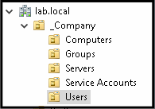
>
> - **Organizational Units** are containers used to organize users, computers, groups and other objects into a logical structure.

**Two users created inside of the "Users" OU:**
>
> 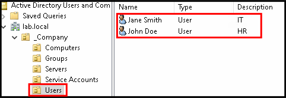
>
**Each user would belong to a separate department:**
 - IT
 - HR
---
 

### <mark>Step 2</mark>: Create Groups and shares:

 

**Global and Domain Local groups added to the "Groups" OU:**

> 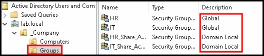
> 
> Permission assignment for these groups will be structured following the **AGDLP model**:
>>
>> 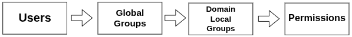
>> 
>> -  **Users** are put into **global groups**. These groups represent the department.
>> - Permissions are only assigned to the **domain local groups**, NOT **global groups** or **users** directly.
>> - A **global group** is added to a **domain local group** and only then do they inherit those permissions. This will allow for scalability as well as separation of roles from resource access.
>>
>>  This is **Microsoft's** recommended way to assign permissions in Active Directory.

**Configured *IT* and *HR* folders as network shares:**

**Before share configuration:**
>
> 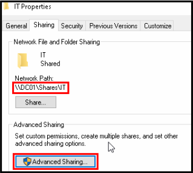
>
> 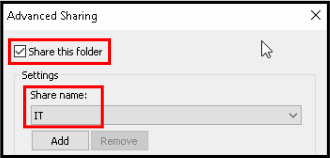

**After share configuration:**
>
>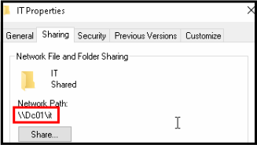
---
 

### <mark>Step 3</mark>: Assign permissions for shares:

 

**Assigned share permissions to *Domain Local* groups:**

> 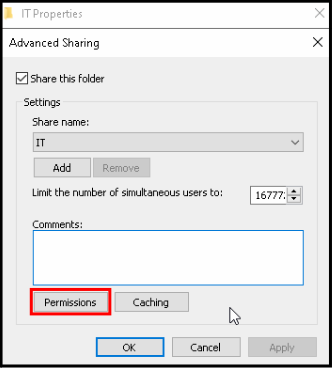
>
> 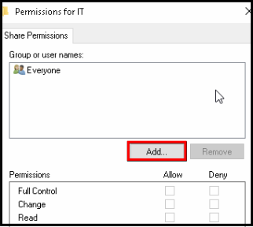
>
> 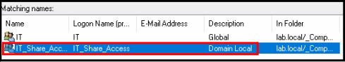
>
>> ***Reminder:** Permissions here are ONLY assigned to Domain Local groups, NOT Global groups or users directly, as per the **AGDLP model**.*

**Administrator access was added to all shares to allow for Administrative troubleshooting:**

> 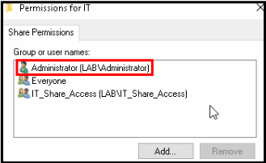

#### 🟥 Problem:

**Users where able to access shares belonging to other departments:**
>
> ***HR* user accessing the *IT* share:**
>
> 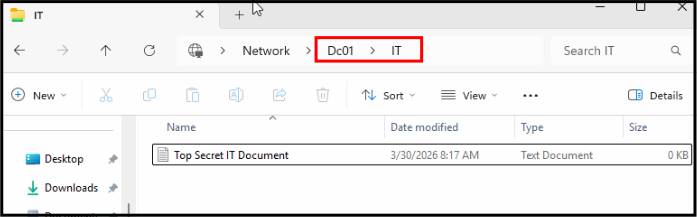

#### 🟨 Why:

**The "Everyone" group had read permissions in both shares:**

> 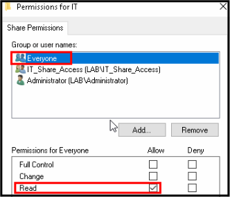
   
#### 🟩 Solution: 

**Removed the "Everyone" group from *Share Permissions* in both shares:**

> 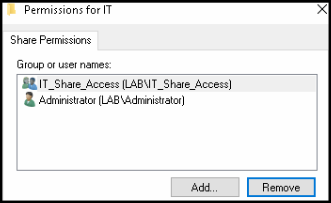

### 🏆 Result:

***HR* user attempting to access the *IT* share:**

> 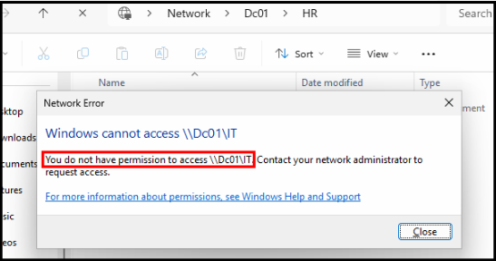
---
 

### <mark>Step 4</mark>: Map drives for each share:

 

#### Why:
   - **By mapping drives for each share, this will not only save users time but also ensure they do not mistakenly attempt to access other department's shares.**

**Creating mapped drives:**

> 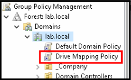
> 
> 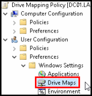
   
**Assigning a unique Drive Letter for each share:**

> 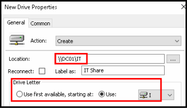

**Targeting the security group (Domain Local group) for each drive:**

> 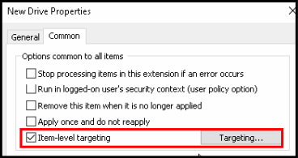
> 
> 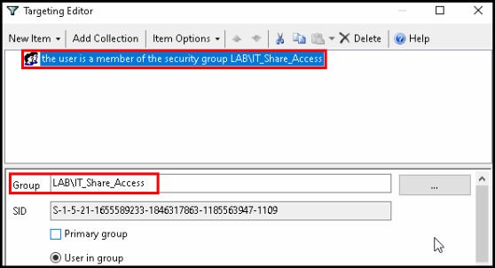
> 
> - This ensures that only members of the corresponding **Domain Local group** would receive the mapped drives.

**Mapped drives created for both the *IT* and *HR* shares:**

> 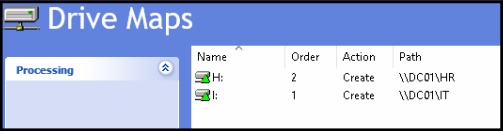

***HR* user accessing the *HR* share through the mapped drive:**

> 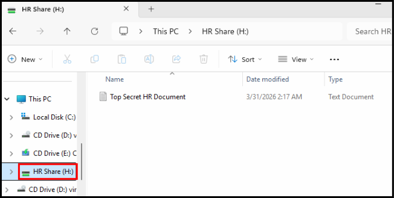
   
