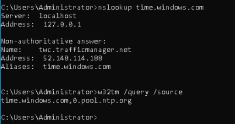
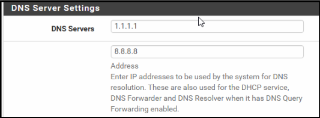
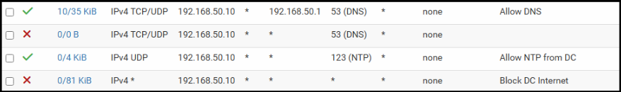
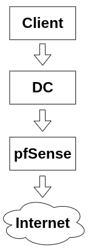

# pfSense

### Goal:
   - Minimize security risk by reducing unnecessary internet access from the **Domain Controller** while relying on ***pfSense's*** default firewall behavior to protect clients from unsolicited inbound internet traffic.

---

 

#### Why pfSense:
   - ***pfSense*** allows for simplified firewall rule creation through the browser UI, making it an ideal choice for someone who has never worked with a firewall before. It also comes with routing capabilities which would be utilized once **VLAN** segmentation is implemented. 

 

##### Preface:
   - *Protection from unsolicited **INBOUND** internet traffic is provided by **pfSense's** default **NAT** and **WAN** firewall behavior. The following rules are intended only for **OUTBOUND** internet traffic.*
---
 

### <mark>Step 1</mark>: Prevent internet access from the Domain Controller:

 

**Added firewall rule to block all traffic from the Domain Controller to the internet:** 

> 
> 
> - Source: 192.168.50.10 (Domain Controller)
> - Destination: Any

#### 🟥 Problem:
   - Upon blocking all outbound internet traffic, NTP synchronization failed because the Domain Controller would no longer be able to perform DNS lookups in order to resolve the name of its external NTP source (time.windows.com).

#### 🟩 Solution:

**Added two rules at the top of the list to allow for *port 123 (NTP)* and *port 53 (DNS)* traffic:**

> 
> 
> **Note:** ***pfSense** uses **top-down rule processing**, meaning rules above take priority over rules below.*

***DNS* + *NTP* now working on the *Domain Controller*:**

> 
---
 

### <mark>Step 2</mark>: Configure pfSense as a DNS Forwarder/Resolver:

 

##### Why:
   - **This centralizes external *DNS* resolution through *pfSense* and separates *Active Directory DNS* from *external DNS* queries.**

**Provided two specific DNS servers for pfSense to use:**

> 

**Updated firewall rules to allow for pfSense DNS resolution:**

> 
> 
> - **Rule 1: *Allow DNS from DC to pfSense***
> 
> - **Rule 2: *Block reachability to all other DNS servers***
> 
> - **Rule 3: *Allow NTP from DC***
> 
> - **Rule 4: *Block all other internet access from DC***

**Updated *DNS* traffic flow:**

