# VLAN Segmentation

### Objective:
   - Segment servers and clients into separate VLANs

---

 

**VLAN assignment:**

 - **VLAN10 (Clients) = *192.168.110.0/24***
 - **VLAN20 (Servers) = *192.168.120.0/24***

 

**VLANs will have a DHCP Address pool range of .100 - .199:**

> 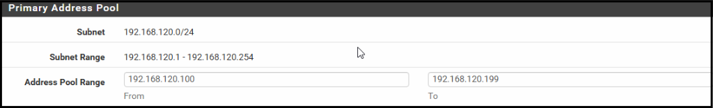

 

### 📝 Origianl plan:

Migrate the ***client machine to VLAN10*** followed by the ***Domain Controller to VLAN20***.

#### 🟥 PROBLEM:

Migrating the client machine to ***VLAN10*** resulted in loss of access to the ***pfSense browser UI*** from the client's browser:

> 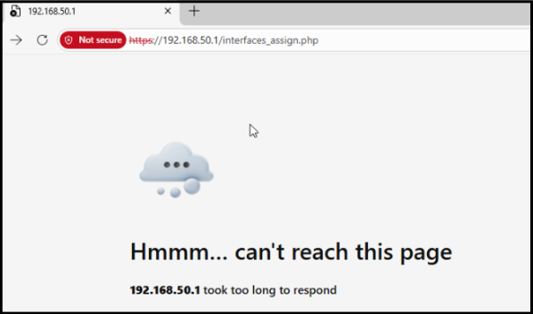
>
#### 🟨 WHY:
> 
The client was now in a different subnet to pfSense but no firewall rule was created to allow traffic from that subnet.
> 
#### 🟩 SOLUTION:

Added ***temporary firewall rule*** to allow all traffic from the ***VLAN10 subnet***:

> 

### 💡 Updated plan:

Migrate the ***Domain Controller to VLAN20*** followed by the ***client machine to VLAN10***.

> **WHY:**
> - Migrating the ***Domain Controller*** first will result in easier management of potential ***DNS/NTP*** issues between the ***client*** and ***DC***.
---
 

### <mark>Step 1</mark>: Move the Domain Controller to VLAN20:

 

**Firewall rules for VLAN20 to allow for DNS and NTP:**

> 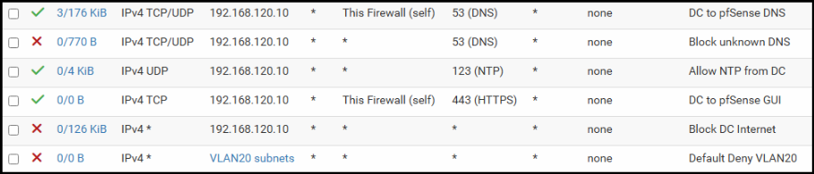

**Windows VLAN tag:**

> 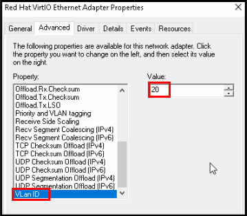

**Request to obtain an IP address automatically from the DHCP server:**

> 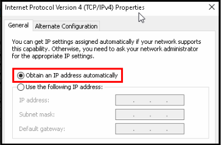
> 
> Why?:
> - *Introducing automation here will reduce the risk of user misinput that can happen when manually configuring IP addresses.*
> 
> **The Domain Controller obtained an IP address of 192.168.120.100:**
>> 
>> 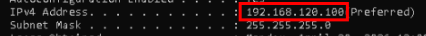

**Set a static DHCP reservation for the Domain Controller using its MAC address:**

> 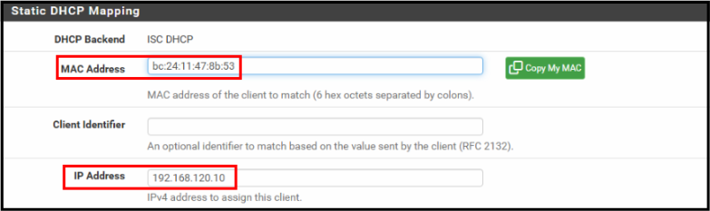
> 
> - **IP reserved for the Domain Controller:** *192.168.120.10*
> 
> **Why?:**
> 
> - *DHCP reservation was used to ensure the Domain Controller always receives the same IP address while still benefiting from centralized IP management.*

**Domain Controller's ipconfig:**

> 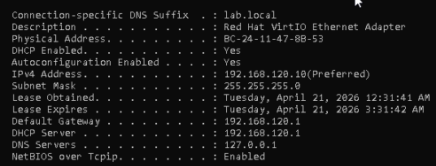
---
 

### <mark>Step 2</mark>: Move clients to VLAN10:

 

**Note:** *Most of the migration process for VLAN10 followed the same procedure as VLAN20. Rehashed steps will not be shown.

 

**Firewall rules for VLAN10:**

> 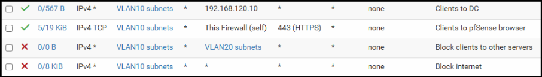
> - **Rule 1: *Allow required AD services from VLAN10 to the Domain Controller***
> - **Rule 2: *Allow pfSense browser UI access from VLAN10***
> - **Rule 3: *Block traffic to all other VLAN20 addresses***
> - **Rule 4: *Block all other traffic from VLAN10***

**The Domain Controller's address was specified as the DNS server in the DHCP config, in order to automate DNS server assignment for clients:**

> 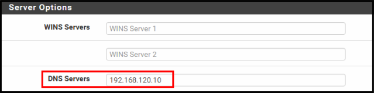

**Client's ipconfig:**

> 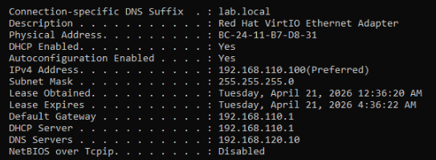

