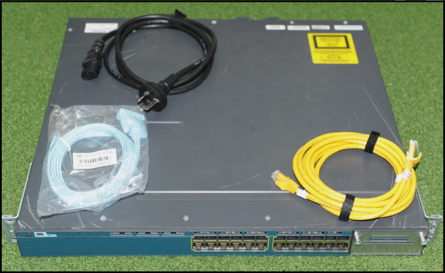
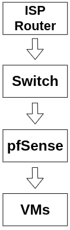
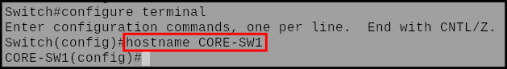
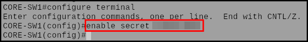
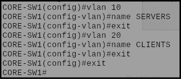
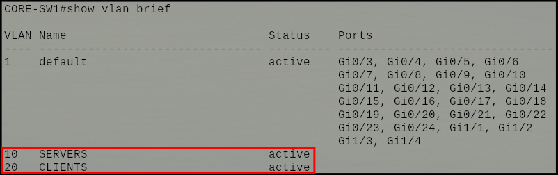
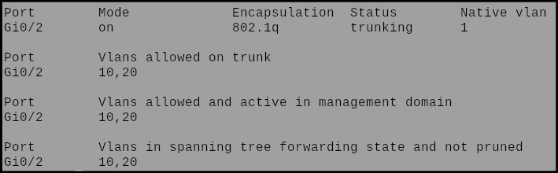
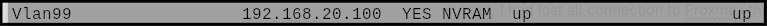
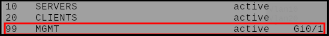
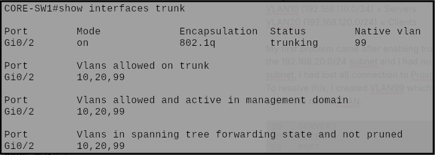

# Cisco Catalyst Switch

### 🎯 Objective:
   - Implement a layer 3 switch to handle inter-VLAN routing.

---

 

### Switch used:

**Cisco Catalyst 3560-X**

> 
> 
> **Price:** $90 AUD
> 
> **Core features:**
> 
> - 24 RJ-45 ports
> - Gigabit Ethernet
> - Fully managed
> - Rack mountable
> - Layer 3
> 
>> **Why layer 3?:**
>> 
>> - Introducing a layer 3 switch into the topology would allow for separation of responsibilities between pfSense and the switch. The switch would handle all inter-VLAN routing, while pfSense remained as a firewall.

 

**Topology goal at this stage:**

> 
	
 

### <mark>Step 1</mark>: Set Up the Switch:

 

**Assigned the switch a hostname of "CORE-SW1":**

> 
	
**Set privileged EXEC mode password:**

> 

**Configure the default gateway:**

> 
---
 

### <mark>Step 2</mark>: VLAN Creation:

 

**Updated VLAN assignment:**

- **VLAN10 (Servers) =** 192.168.110.0/24
- **VLAN20 (Clients) =** 192.168.120.0/24

**Assigned VLAN names:**

> 

**VLAN SVIs created:**

> 
> 
> - These are the default gateways for the VLANs
		
**VLAN status:**

> 

**Trunking configured on Gi0/2 (Port 2):**

> 

 

### 🟥 Problem:

**The trunk only allows for VLAN10 and VLAN20 tagged traffic, while Proxmox lives on the 192.168.20.0/24 subnet. Since all traffic that isn't tagged for VLAN10 or VLAN20 gets sent to the native VLAN (VLAN1 by default), this results in loss of access to Proxmox's browser UI.**

### 🟩 Solution:

**VLAN99 was created, and an SVI was configured with an address of 192.168.20.100 to provide management access to the switch. VLAN99 would also act as the native VLAN:**

> 

 

**VLAN99 assigned to Gi0/1 (Port 1):**

> 

**Updated trunking setup:**

> 

#### Why VLAN99 instead of VLAN1:

> **Cisco uses VLAN1 by default for:**
>
> - Control Traffic
> - Switch Port Assignment
>
> Having a dedicated Management/Native VLAN is much cleaner.

