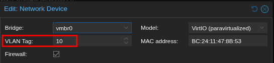
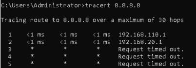
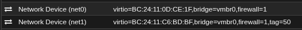
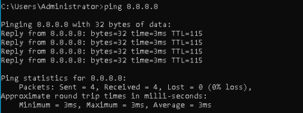
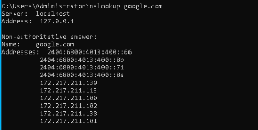

 # VLAN Migration

### 🎯 Objective:
   - Successfully move the Domain Controller over to VLAN10 (192.168.110.0/24)

---

 

### <mark>Step 1</mark>: Prepare Proxmox and pfSense for VLAN migration:

 

**Made the Proxmox bridge VLAN-aware:**
>
> 

**Set the VLAN tag directly to the VM instead of the VirtIO adapter inside Windows:**
>
> 
>	
>**Why?:**
> - This provides centralized management making it easier to troubleshoot potential issues in the future.
>
> - Users inside the VM cannot accidentally break VLAN configuration.
---
 

### <mark>Step 2</mark>: Start the migration process:

 

**Manually assigned the Domain Controller an address of 192.168.110.10:**

> 

#### 🟥 Problem #1:
Upon moving the **Domain Controller to VLAN10**, all reachibility to addresses outside of **VLAN10** was lost.

**Ping test from Domain Controller:**
>  
> 

#### 🟨 Theory:
Incoming traffic back to VLAN10 was getting dropped by the **ISP router** because it didn't know where **192.168.110.10 (Domain Controller's address)** was.

#### 🟩 Solution:
**Added static routes to the ISP router config:** 
>
> 
>
> - **192.168.20.100 =** VLAN99 SVI

 

#### 🟥 Problem #2:
**Using tracert, we see that traffic has no trouble reaching the ISP router, however after that, the traffic is dropped:**
>
> 

#### 🟨 Updated theory:
Since setting static routes for **VLAN10 and VLAN20** did NOT resolve the problem, the issue is likely occurring beyond the router. This may suggest that the ISP router is unable or unwilling to NAT traffic from VLAN10, preventing traffic from finding its way back to the Domain Controller.

### 🟩 Solution/Change of plan:
Unfortunately, this ISP router does **NOT** provide NAT setting that can be changed in order to resolve this issue. Because of this, **pfSense** will be reintroduced as an edge router while still having the switch handle all inter-VLAN routing.

---
 

### <mark>Step 3</mark>: Create and configure a transit VLAN:

 

#### Why a transit VLAN?:
> The switch and pfSense will now both be routing to each other, but both live in different subnets. **VLAN50 (Transit VLAN)** was created as a direct link for both routing devices to communicate.

 

### VLAN50 = 192.168.150.0/30
**Why /30?:**
> Only the **pfSense gateway (192.168.150.1)** and the **switch's VLAN50 SVI (192.168.150.2)** will be on this VLAN, meaning only 2 host addresses are needed.

 

**VLAN50 created:**

> 

**Switch's VLAN50 SVI:**

> 
	
**Switch's new default gateway (pfSense):**

> 

**Two NICs were added to the pfSense VM:**

> 
> 
> - **net0** = WAN
> - **net1** = LAN (VLAN traffic)
> 
> **net0** was left without a VLAN tag since all untagged WAN traffic will be going through the **native VLAN (VLAN99)**.
> 
**pfSense WAN and LAN assignment:**

> 

---
 

### <mark>Step 4</mark>: Set up pfSense static routes and NAT rules:

 

**Temporary "Allow Any" rule added to the LAN firewall in pfSense:**

> 
>
> - This would ensure all traffic could cross over the **transit VLAN (VLAN50)**.

**Successful ping test from the switch to pfSense:**

> 

**Static routes added for VLAN10 and VLAN20:**

> 
>
> - Without these, pfSense wouldn't know where to send traffic to for either subnet.
	
**Outbound NAT rules created for both VLANs:**

> 
>
> - This resolves the original issue by allowing pfSense to perform outbound NAT for the VLAN networks before forwarding traffic to the ISP router.

 

### 🟩 Result:

The **Domain Controller had been successfully migrated to VLAN10**, and traffic was now able to reach beyond the ISP router without being dropped.

**Successful DC ping test:**

> 

**Successful DC DNS test:**

> 

--- 
 

### <mark>Updated traffic flow</mark>:
 

> 
